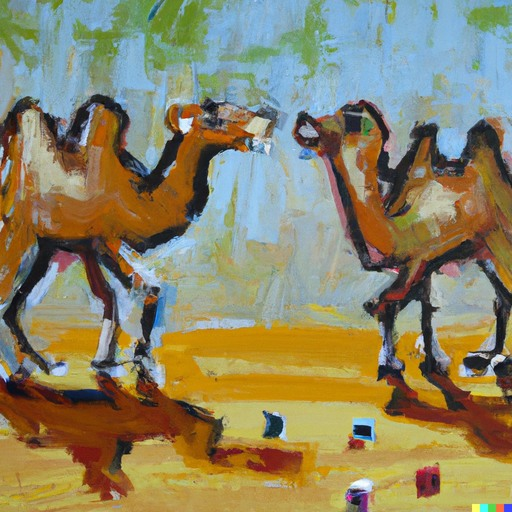
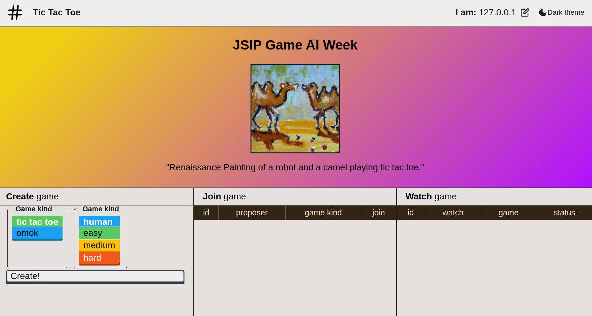

# Tic-Tac-Toe



In this week you will learn about _adversarial games_ and 
game AIs to implement OCaml 🐫 bots that play [**tic-tac-toe**](https://en.wikipedia.org/wiki/Tic-tac-toe) and
[**Gomoku**](https://en.wikipedia.org/wiki/Gomoku).


In these exercises you will:
- _Play_ **TIC TAC TOE**!!
- _Write_ a bot to play **TIC TAC TOE**!!
- _Improve_ your **TIC TAC TOE bot**!!

## Background

_Tic-tac-toe_ is a game in which two players take turns in placing either
an `O` or an `X` in one square of a __3x3__ grid. The winner is the first
player to get __3__ of the same symbols in a row.

_Gomoku_ (also commonly referred to as "Omok"), is very similar to tic-tac-toe,
but __bigger__. Two players play on a 15x15 board and the winner is the first
player to get __5__ pieces in a row.

You can think of a digital tic-tac-toe board as a "mapping" of "position -> piece"
with the following types:

```ocaml
module Position = struct
  (* [position] in the board.
  
     (e.g. "top-left" cell is (row, column) (0, 0), and
     "bottom mid" cell is (2, 1)) *)
  type t =
    { row : int
    ; column : int
    }
end

module Piece = struct
  type t = 
    | X
    | O
end
```

For example, the board:

```
 X | - | - 
___|___|___
 - | O | X 
___|___|___
 - | O | - 
```

Can be represented as a mapping of:

```
(row, column)
  (0, 0) => X
  (1, 1) => O
  (1, 2) => X
  (2, 1) => O
```

### Exercise 0.0

What board does the following "mapping" represent? Is there anything interesting
happening? (Hint: If you were O, what move would you play?) Feel free to edit
the "Answer board" below:

```
(row, column)
  (1, 1) => X
  (0, 0) => O
  (0, 2) => O
  (2, 0) => X
  (2, 1) => X
  (2, 2) => O
```

Answer board:

```
 - | - | - 
___|___|___
 - | - | - 
___|___|___
 - | - | - 
```

After you've answered look for a fellow fellow near you and discuss your
answers!

## Prep Work

First, fork this repository by visiting [this
page](https://github.com/jane-street-immersion-program/tictactoe/fork) and clicking on the
green "Create fork" button at the bottom.

Then clone the fork locally (on your AWS machine) to get started. You can clone a repo on
the command line like this (where `$USER` is your GitHub username):

```sh
$ git clone git@github.com:$USER/tictactoe.git
Cloning into 'tictactoe'...
remote: Enumerating objects: 61, done.
remote: Counting objects: 100% (61/61), done.
remote: Compressing objects: 100% (57/57), done.
remote: Total 61 (delta 2), reused 61 (delta 2), pack-reused 0
Receiving objects: 100% (61/61), 235.81 KiB | 6.74 MiB/s, done.
Resolving deltas: 100% (2/2), done.
```

Now you should be able to enter into the project's directory, build the starter
code, and run the executable binary like this:

```sh
$ cd tictactoe
tictactoe$ dune build
tictactoe$ dune runtest
tictactoe$ dune exec student/bin/game_ai.exe help
Bot-running command

  game_ai.exe SUBCOMMAND

=== subcommands ===

  create-game-and-play       . Send off an rpc to create and game and then plays
                               the game, waiting for the other player to place
                               pieces
  create-game-and-play-against-self
                             . Send off an rpc to create and then immediately
                               start playing against itself
  join-game-and-play         . Send off an rpc to join a game and then randomly
                               places pieces using web socket rpc
  version                    . print version information
  help                       . explain a given subcommand (perhaps recursively)
```

> NOTE: If you are getting a problem like `Library "bonsai" not found.` or a
> type error, this is fine and expected. You can run the following commands
> to fix the problem:

```sh
opam update
opam upgrade -y # [-y] stands for "answer yes to all the prompts".
opam install bonsai -y
opam install cohttp_static_handler -y
dune build
```

> "opam" (OCaml's package manager) can be a bit weird at times, so please raise
> your hand/reach out for a TA if `dune build` does not work afterward.

## Directory Layout

This repository contains three components:
* A "game server" that keeps track of all running games, and that
  you can "connect" to and play. It lets you play against bots from other
  fellows, and also has some bots of its own to play against.
* A web UI where you can see all running games, spectate games, and play
  directly from the UI. We have a centralized version of the game server
  and game UI hosted [here](http://ec2-3-215-240-47.compute-1.amazonaws.com:8181/).
* A directory called [student] with exercises that gradually build up a
  game AI.
  
This week you will not be writing game server nor UI code, and will instead
focus on the "student" directory:
  
```sh
tictactoe$ tree student
student
├── bin
│   ├── dune
│   ├── game_ai-help-for-review.org
│   ├── game_ai.ml
│   └── game_ai.mli
├── exercises
│   ├── bin
│   │   ├── dune
│   │   ├── tic_tac_toe_exercises-help-for-review.org
│   │   ├── tic_tac_toe_exercises.ml
│   │   └── tic_tac_toe_exercises.mli
│   └── src
│       ├── dune
│       ├── tic_tac_toe_exercises_lib.ml
│       └── tic_tac_toe_exercises_lib.mli
└── src
    ├── dune
    ├── tictactoe_game_ai.ml
    └── tictactoe_game_ai.mli

6 directories, 14 files
```

* `student/bin` contains the "game_ai" executable that you can use to run your tic-tac-toe bot.
* `student/exercises` and `student/src` are where you'll be implementing your bot.
* `common` contains types like `Piece.t`, and `Position.t` and other types shared by the game
  server and the ui.
* `client`, `server`, and `rpc-client` are where the UI and server are implemented. You will
  not be writing code here, but are needed in case you want to "run" the game server
  and game UI locally.


### Game Server

There are other directories like `server`, `rpc-client`, and more. These directories
contain the "game server" that you can use to spectate your games!

You can run the game server by running the `./run-game-server.sh` script:

```
tictactoe$ ./run-game-server.sh -port 8181
Game server running on port 8181
```

You should then be able to navigate to: http://$YOUR_AWS_HOSTNAME:8181

> NOTE: You can find your public AWS hostname with: `curl http://169.254.169.254/latest/meta-data/public-hostname`

You should see a game server site like this:



> NOTE: If you can't see the above site, do not worry! We have a **shared, centralized server**
> hosted [here](http://ec2-3-215-240-47.compute-1.amazonaws.com:8181/). Its
> hostname and port are: http://ec2-3-215-240-47.compute-1.amazonaws.com:8181/.
> We will soon be opening the `8181` port on your AWS boxes so that you can
> view your locally running web server.

## Exercises

You can think of an AI that plays tic-tac-toe board as a "function" of type
`me:Piece.t -> game_state:Game_state.t -> Position.t`.

Where the `me` parameter is the "piece" that the bot is playing as, and
`Game_state.t` is the state of the board (where all the pieces are, and also
the type of game you're playing (i.e. 3x3 tic-tac-toe vs. 15x15 Omok)), and the 
returned position is the place you've picked to put your position.

Over the course of these exercises you will be gradually building such a function.

> META NOTE: Throughout these exercises there are notes and hints, but don't feel
> like you shouldn't read them/spoil yourself due to the hints, it's the opposite!
> You should feel encouraged to read all the hints/notes in a given exercise's
> instructions before taking a stab at the exercise.

### Exercise 1

Your AI _needs_ to make a decision of "which free available spot" it should
pick. Let's find "all free available spots"! Implement
`available_moves` in `student/exercises/src/tic_tac_toe_exercises_lib.ml`. 

```ocaml
val available_moves : game_kind:Game_kind.t -> pieces:Piece.t Position.Map.t -> Position.t list
```
You can view documentation/definitions of the above types in `common/protocol.mli`.

> HINT: [Map] is a new OCaml module that you have not seen before! It is
> OCaml's equivalent of python dictionaries, Java HashMap's or any language's
> "map". Available functions can be found here:
> [Real World Ocaml](https://dev.realworldocaml.org/maps-and-hashtables.html).
> and on [ocaml.org's docs page](https://ocaml.org/u/c208440793aa1aa9d82e70e53cad6da8/base/v0.15.0/doc/Base/Map/index.html).
  > If map's/dictionaries are a new concept to you this is fine! Feel free to ask a TA
  > for help/ask on the #questions Slack channel if something is unclear!

Here is a [Map] function that you might find useful:

```ocaml
(** Returns a list of the keys in the given map. *)
val keys : ('k, _, _) t -> 'k list
```

> NOTE: The type `('k, 'v, 'cmp) Map.t` means a map from with keys of type
> `'k` and values of type `'v`. For example, `(Position.t, Piece.t,
> Position.comparator_witness) Map.t` is a map from `Position.t` to `Piece.t`.
> The `'cmp` parameter is magical, and you can mostly ignore it. If you're
> interested, read about it on the "Real World OCaml" link above or ask a TA!
> 
> Something else weird syntax-wise is that the type `(Position.t, Piece.t,
> Position.comparator_witness) Map.t` **is the same as** `Piece.t Position.Map.t`.

> HINT: Look for `Map.to_alist`/`Map.keys` in the [ocaml docs](https://ocaml.org/u/c208440793aa1aa9d82e70e53cad6da8/base/v0.15.0/doc/Base/Map/index.html), and also leverage `List.filter`.

> HINT: To find all the "free slots", you might first need a function to find
> "all the slots" for tic-tac-toe/omok.

Once you've implemented [available_moves], feel free to uncomment the "available_moves" tests
near the bottom of `student/exercises/src/tic_tac_toe_exercises_lib.ml`, we have prepared some example boards 
for you to test with, but feel free to add test cases of your own! You can run tests
with `dune runtest`.

We've also prepared some commands that you can run for the exercises to inspect
your output. Feel free to edit and run them for debugging. They are defined
within `student/exercises/src/tic_tac_toe_exercises_lib.ml`.

```sh
tictactoe$ dune exec student/exercises/bin/tic_tac_toe_exercises.exe help
Tic Tac Toe exercises

  tic_tac_toe_exercises.exe SUBCOMMAND

=== subcommands ===

  exercise-four              . Exercise 4: Is there a losing move?
  exercise-one               . Exercise 1: Where can I move?
  exercise-three             . Exercise 3: Is there a winning move?
  exercise-two               . Exercise 2: Did is the game over?
  version                    . print version information
  help                       . explain a given subcommand (perhaps recursively)
```

#### Exercise 1.2

A simple strategy for a game AI is "picking a random available spot".

Implement [random_move_strategy] inside `student/src/tictactoe_game_ai.ml`

> HINT: You'll want to use the `List.random_element_exn` function you learned about
> during snake, and also the function `available_moves` that you just implemented.

> HINT 2: Your `available_moves` function is defined within `student/exercises/src/tic_tac_toe_exercises_lib.ml`,
> but the `random_move_strategy` is found within `student/src/tictactoe_game_ai.ml`. These
> are known as different ["dune libraries"](https://dune.build/examples). If you try to use
> `Tic_tac_toe_exercises_lib` from within `tictactoe_game_ai.ml`, you'll get an error
> like "Unbound module Tic_tac_toe_exercises_lib". To be able to use it, you'll need
> to explicitly add it as a dependency within its dune file by adding
> "tic_tac_toe_exercises_lib" to the "libraries" field inside `tictactoe_game_ai`'s dune
> file `student/src/dune`:


```diff
 (library 
   (name tictactoe_game_ai)
   (inline_tests)
   (preprocess (pps ppx_jane))
-  (libraries tic_tac_toe_2023_common))
+  (libraries tic_tac_toe_2023_common tic_tac_toe_exercises_lib))
```

After you are done, make [compute_next_move] (found within the same file) use
[random_move_strategy] to compute its next move.

#### Exercise 1.3

Let's have your random strategy connect and play against the game server!

The `game_ai.exe` executable has three commands that use your [compute_next_move]
function to play a game on the game server. Here are a couple of ways of playing:

```sh
tictactoe$ _build/default/student/bin/game_ai.exe --help
Bot-running command

  game_ai.exe SUBCOMMAND

=== subcommands ===

  create-game-and-play       . Send off an rpc to create and game and then plays
                               the game, waiting for the other player to place
                               pieces
  create-game-and-play-against-self
                             . Send off an rpc to create and then immediately
                               start playing against itself
  join-game-and-play         . Send off an rpc to join a game and then randomly
                               places pieces using web socket rpc
  version                    . print version information
  help                       . explain a given subcommand (perhaps recursively)
```

> NOTE: We are using `_build/default/student/bin/game_ai.exe --help`
> instead of `dune exec student/bin/game_ai.exe -- --help` as it makes
> sending arguments less confusing.


> NOTE: These are the "host" and port of the shared whose web ui is viewable at:
> this link: [http://ec2-3-215-240-47.compute-1.amazonaws.com:8181/](http://ec2-3-215-240-47.compute-1.amazonaws.com:8181/):

```sh
GAME_SERVER_HOST='ec2-3-215-240-47.compute-1.amazonaws.com'
GAME_SERVER_PORT=8181
FAVORITE_POKEMON='bulbasaur' # Pick your own favorite Pokémon!
```

Optional: you can run your own private/local game server by running the following script:

```sh
tictactoe$ ./run-game-server.sh -port 8181
Game server running on port 8181
```

and your "hostname" would be the output of `curl http://169.254.169.254/latest/meta-data/public-hostname`.

##### Your strategy vs. your strategy.

Let's play your strategy against itself!

```sh
tictactoe$ _build/default/student/bin/game_ai.exe create-game-and-play-against-self -game-kind Tic_tac_toe -host $GAME_SERVER_HOST -username $FAVORITE_POKEMON -port $GAME_SERVER_PORT
```
You'll see your game being played inside of
[http://ec2-3-215-240-47.compute-1.amazonaws.com:8181/](http://ec2-3-215-240-47.compute-1.amazonaws.com:8181/)
(or inside your local web ui if you're running your own game server).

The game might be short-lived, but if you pick "Omok" instead of "Tic_tac_toe", your game
will run for a while.

##### You vs. your strategy

You can play against your bot by running the `create-game-and-play` command:

```sh
tictactoe$ _build/default/student/bin/game_ai.exe create-game-and-play -port $GAME_SERVER_PORT -game-kind Tic_tac_toe -host $GAME_SERVER_HOST -username $FAVORITE_POKEMON
successfully created game with id: '11'
Waiting for someone to join...
```

Your game will then show up as a "joinable game", and then you can click it to join it.
Also feel free to change your "__I am:__ IP_ADDRESS" to something else. (Sadly there's no
authentication/anything like that so pick a unique username like your favorite
Pokémon/rodent.)

##### Your strategy vs. a "Game Server" bot.

You can play against the game server bot by specifying `-against-bot` to the
`create-game-and-play` command:

```sh
# Easy
tictactoe$ _build/default/student/bin/game_ai.exe create-game-and-play -port $GAME_SERVER_PORT -game-kind Tic_tac_toe -host $GAME_SERVER_HOST -username $FAVORITE_POKEMON -against-bot Easy
successfully created game with id: '15'
"successfully took turn!"
"successfully took turn!"
"successfully took turn!"
"successfully took turn!"
"successfully took turn!"
("Game is over!" (winner ((Player bulbasaur))))

# Hard
tictactoe$ _build/default/student/bin/game_ai.exe create-game-and-play -port $GAME_SERVER_PORT -game-kind Tic_tac_toe -host $GAME_SERVER_HOST -username $FAVORITE_POKEMON -against-bot Hard
successfully created game with id: '13'
"successfully took turn!"
"successfully took turn!"
"successfully took turn!"
("Game is over!" (winner ((Server_bot Hard))))
```

##### Your strategy vs. another fellows strategy

You can play against another fellow's strategy by first running
`create-game-and-play`, and then the other fellow's strategy can
join your game with the `join-game-and-play` with your game's id.
The player that creates the game has the first turn.

Reach out to another fellow here and play against their random bot. If no one
is available feel free to move on to exercise 2.

> At this point you are done with exercise 1. Congrats!
> Before moving on to exercise 2, feel free to save your work,
> and commit it and push it to github.

### Exercise 2

We now have a working random strategy. Let's improve it!

The next strategies we'll implement are "If there is a move I can make __right
now__ that wins, let's do it, otherwise do a random move". To do this we'll
need to evaluate all "next possible moves", but first, let's do something
simpler:

One question you might ask is: Is already over? Has someone already won? Is
there a tie? Is a piece ready to be placed/does the game continue?

Your task for exercise 2 is implementing:

```ocaml
val evaluate : game_kind:Game_kind.t -> pieces:Piece.t Position.Map.t -> Evaluation.t
```

where evaluation has the type:

```ocaml
module Evaluation = struct
  type t =
    | Illegal_state
    | Game_over of { winner : Piece.t option }
    | Game_continues
end
```

You can implement this function in `student/exercises/src/tic_tac_toe_exercises_lib.ml`

One way you could imagine implementing this function is by "scanning" the board
for patterns of length 3 (for tic tac toe) or 5 (for omok), in rows/columns/or
diagonals. For example, the animation below scans for all rows of length 5:


Here are some [*Map*] functions that you might find useful:

```ocaml
(** Returns [Some value] bound to the given [key], or [None] if none exists. *)
val find : ('k, 'v, 'cmp) Map.t -> 'k -> 'v option

(** [mem map key] tests whether map contains a binding for key. *)
val mem : ('k, _, 'cmp) t -> 'k -> bool
```

> NOTE: The type `('k, 'v, 'cmp) Map.t` means a map with keys of type
> `'k` and values of type `'v`. For example, `(Position.t, Piece.t,
> Position.comparator_witness) Map.t` is a map from `Position.t` to `Piece.t`.
> The `'cmp` parameter is magical and you can mostly ignore it. If you're
> interested, read about it on the "Real World OCaml" link above or ask a TA!
> 
> Something else weird syntax-wise is that the type `(Position.t, Piece.t,
> Position.comparator_witness) Map.t` **is the same as**  `Piece.t Position.Map.t`.

> NOTE 2: You might also find `List.exists` from the snake exercises useful.

Additionally, there are some functions that might be helpful available 
for operating on `Position.t`'s

```ocaml
module Position : sig
  (* Top-left is {row = 0; column = 0}. *)
  type t =
    { row : int
    ; column : int
    }

  val in_bounds : t -> game_kind:Game_kind.t -> bool
  val equal : t -> t -> bool
  
  (** [down t] is [t]'s downwards neighbor. *)
  val down : t -> t
  val right : t -> t
  val up : t -> t
  val left : t -> t


  (** [all_offsets] is a list of functions to compute all 8 neighbors of a
      cell (i.e. left, up-left, up, up-right, right, right-down, down,
      down-left). *)
  val all_offsets : (t -> t) list
end
```

> NOTE: [Position] is defined in `common/protocol.mli`.

Also remember to uncomment the tests at the bottom of
`tic_tac_toe_exercises_lib.ml` once you are done.

### Exercise 3

Using [evaluate] and [available_moves], let's implement `winning_moves` in
`student/exercises/src/main.ml`.

```ocaml
(* A list the list of moves that win the game in one move. *)
val winning_moves : me:Piece.t -> game_kind:Game_kind.t -> pieces:Piece.t Position.Map.t -> Position.t list
```

It will look at all available moves, and see if they would win the game in 1 move.

You might find `Map.set` useful.

When you're done, uncomment the expect tests and move on to exercise 3.2. Also,
remember to commit+push.

#### Exercise 3.2

Using [winning_moves], let's implement [pick_winning_move_if_possible_strategy] in
`tictactoe_game_ai.ml`. If there is a winning move, it'll pick it. Otherwise, it'll
just pick a random move. Let's also update `compute_next_move` to use
`pick_winning_move_if_possible_strategy`.

Run your bot using the commands from exercise 1.3. Play against it on the UI,
does it pick a winning position if it sees one? Can it beat the `Easy` bot more
often? 

### Exercise 4

Alright, now we have a better strategy, let's _improve_ it!

The next strategy we'll implement is "if the bot sees that its opponent can
win in the next move, it'll __block__ its opponent from winning".

Your task for exercise 4 is to implement `losing_moves` within
`tic_tac_toe_exercises_lib.ml`.

> HINT: A "losing move" is a "winning move" for your opponent after all. You
> might find `Piece.flip` useful!

When you're done, uncomment the expect tests and move on to exercise 4.2. Also,
remember to commit+push!

#### Exercise 4.2

Like before, in `tictactoe_game_ai.ml`, implement the descriptively named
[pick_winning_move_or_block_if_possible_strategy], and update
[compute_next_move] to use it.

Play against your bot! Can you win against it? How often can it beat the `Easy`
bot?

### Exercise 5

We've never mentioned its name thus far, but we've been secretly been implementing
a version of the algorithm ["Minimax"](https://en.wikipedia.org/wiki/Minimax). It
was one of the earlier algorithms to beat humans at complex games like chess,
and it's also the algorithm we'll be implementing next.

Thus far we've implemented an algorithm that can look __1__ move into the future
and if it can win/not lose into the future, it can make the best decision. One
immediate idea is:

1. What if we look **further** into the future?

Take a moment to intuitively think, for yourself on a piece of paper/on a text
file, if you could look __2__ moves into the future on tic tac toe/how would
you pick your next move? What about __3__? Discuss with another fellow or if no
one is available talk to a TA!


Minimax has a couple of parts:

* __score__: What is the current "score" of the game's position? This is a bit
  silly on a game like tic-tac-toe/omok, but you could think of "winning" as
  +infinity score and losing as -infinity score. You could also come up with
  heuristics like, if I see "2" pieces together, then I add 4, if my opponent has
  4 pieces together, then I subtract 50. Or even if I have n pieces together, I
  add `n*n` to my score.
* __maximizing__ player: You win when your score reaches +infinity, so you want
 to __maximize__ the score.
* __minimizing__ player: Your opponent wins when the score reaches -inifinity, so
  they will always want to __minimize__ the score.
  
Minimax assumes that both players will play optimally, so minimax assumes that
the __maximizing__ player will always pick the move that results in the maximum
score, and that the __minimizing__ player picks the smaller score.

Minimax operates under a "max-depth" it will travese to it will take as a parameter
"how many moves into the future" it should try to evaluate. It will then build
a tree like the ones shown in this [wikipedia page](https://en.wikipedia.org/wiki/Minimax)
and run the __score__ function on "terminal" nodes that are nodes where
either the game ends (score is infinity) or where the max depth has been reached.


Here are more resources on minimax. Also feel free to ask TA's if you have any questions:
- [Really cool video by Sebastian Lague](https://youtu.be/l-hh51ncgDI)

#### Exercise 5.1

You can use your already implemented `evaluate` function to implement a `score`
function. You can implement `score` in `tictactoe_game_ai.ml`. A very basic 
version of score can be -infinity for loss, +infinity for win, [0.0] for the
game continuing.

#### Exercise 5.2

Read the pseudocode on minimax from [wikipedia](https://en.wikipedia.org/wiki/Minimax#Pseudocode).

**What is a "terminal node"?**

A terminal node is the game ending by someone winning/losing
or by the game tie'ing due to all of the slots being filled.

**What is the "heuristic value of node"?**

It would be the `score` function you just implemented.

**What is the "child of node"**?

The `available_moves` function you implemented in exercise 1.

If you have any questions please ask a TA!

#### Exercise 5.3

Implement minimax by following the pseudocode from wikipedia. Some functions
you might find handy are:

```ocaml
val min_elt : 'a list -> compare:('a -> 'a -> int) -> 'a option
val max_elt : 'a list -> compare:('a -> 'a -> int) -> 'a option

(** fold t ~init ~f returns f (... f (f (f init e1) e2) e3 ...) en, where e1..en are the elements of t *)
val fold : 'a list -> init:'accum -> f:('accum -> 'a -> 'accum) -> 'accum
```

> HINT: OCaml required the `rec` keyword for recursive functions.

You can write this function, with the parameters of your choosing within
`tictactoe_game_ai.ml`.

Once you are done, you can update `compute_next_move` to make your AI executable
use minimax and play with your AI! How much better is it? How far deep can you 
set the parameter on tic tac toe? What about Omok? How slow/fast is it? Can it beat
the medium server bot? What about the hard server bot? Can you win against it?


### Extensions

This is a list of possible extensions you could implement. You are also free to
come up extensions of your own/ideas of your own to beat the "Hard" server
bot/be faster than the server bot.

- Change [available_positions] to only pick empty positions that are next to occupied
  pieces to lower the search space. Does the depth you can explore increase?
- Make your score function "heuristic based" by scoring 2/3/4 consecutive pieces
  an "n*n" score.
- Implement a minimax optimization called [alpha beta
  pruning](https://en.wikipedia.org/wiki/Alpha%E2%80%93beta_pruning). Does the depth
  that you can explore increase?
- Make evaluation super fast by using [bit
  masks](https://medium.com/@LukeASalamone/creating-an-ai-for-gomoku-28a4c84c7a52).
- Pick different heuristics for your [score] function.

--
